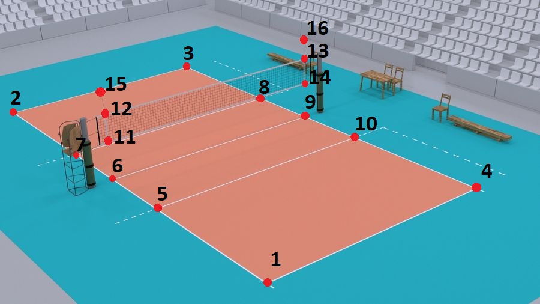
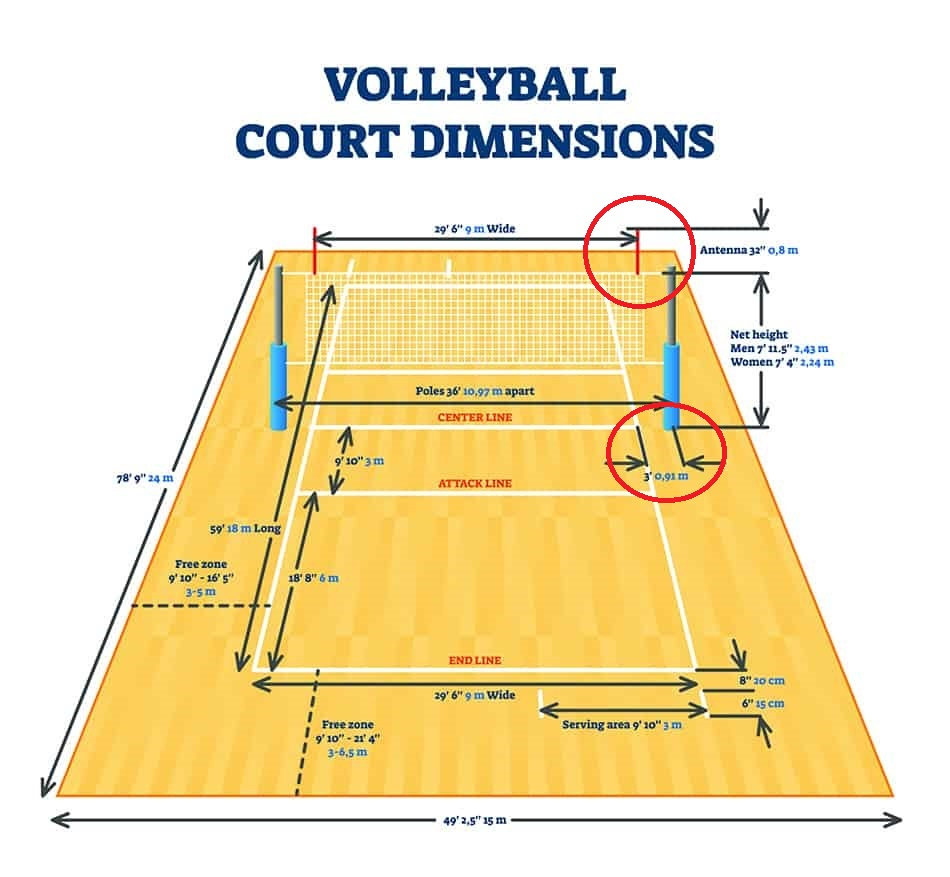

# 3D Ball Reconstruction
In this repository we use outputs of TrackNet models for making 3D trajectory. 

Tabel of contents:
- Make Pairs of 3D point and 2D point


## Make Pairs
First step to using this repository you need to make at least 6 pairs of 3D/2D point that belongs to your video cameras.

so use this block of code to make that.

name variable is used to save a .npy file with that name. 

data is used to defining pairs. each row contain 5 element that fist 3 element is X,Y,Z point in 3D volleyball court and last 2 element is x,y point in image format.
```python
name = '6_p1'
data = [
    [0,-6,0, 155, 480],
    [0,-12,0, 227, 333],
    [9,-12,0, 1076, 331],
    [9,-6,0, 1139, 479],
    [0,-9,2.43, 183, 155],
    [9,-9,2.43, 1111, 153],
]
data = np.array(data)
np.save('./data/'+name+'.npy', data)
```
you can see ***make_data.py*** file for usage this code.

3D important point is like this:


<p align="center">

</p>

and each point in above image has X,Y,Z value based on below image:

<p align="center">

</p>

| Point ID | X | Y | Z |
| :---: |    :----:   | :---: | :---: |
| 1   | 0 | 0 | 0 |
| 2   |  0|-18  |0  |
| 3   |  9|-18  | 0 |
| 4   |9|0|0|
| 5   |0|-6|0|
| 6   |0|-9|0|
| 7   |0|-12|0|
| 8   |9|-12|0|
| 9   |9|-9|0|
| 10  |9|-6|0|
| 11  |0|-9| - |
| 12  |0|-9|2.43, 2.24|
| 13  |9|-9|2.43, 2.24|
| 14  |9|-9| - |
